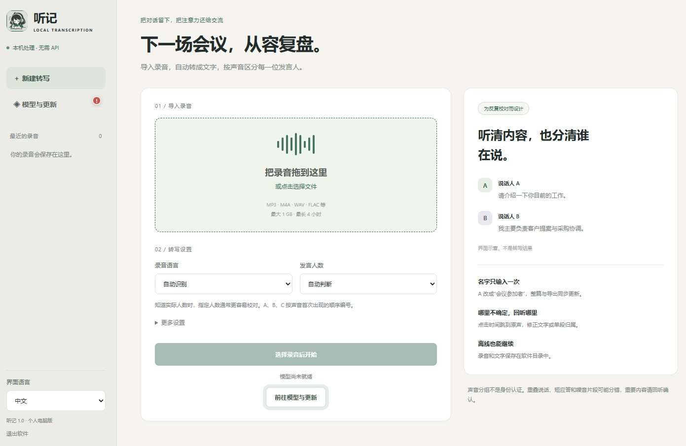

# 听记 / HearNotes
当前项目仍处于开发阶段。可能会存在大量bug, 请在使用时注意。
本人非专业开发人员，仅作为个人项目学习和使用。
软件更新随缘，不保证及时发布。

This project is still under development and may contain many bugs. Please use it with care.
I am not a professional developer; this is a personal project for learning and personal use.
Updates are released when time permits and may not arrive on a regular schedule.

本地离线录音转写与说话人分离桌面应用 
Local, offline audio transcription and speaker diarization for Windows

> 本项目的代码、文档和部分测试内容基本由 AI 生成。AI 生成内容可能存在错误，请在实际使用和再次分发前自行检查。
>
> The source code, documentation, and parts of the testing workflow were largely generated by AI. AI-generated content may contain errors; review it before actual use or redistribution.

[中文](#中文说明) · [English](#english)

  

## 中文说明

### 软件简介

听记是一款 Windows 桌面录音转写工具。它在本机完成语音识别和说话人分离，将不同声音标记为 A、B、C 等，并提供逐段回听、文字校对、发言人调整、统一改名和结果导出功能。

正常转写不会将录音上传到云端，也不需要语音识别 API Key。首次下载模型、检查模型更新和检查软件更新时需要联网。

### 主要功能

- 自动识别录音语言和发言人数，也支持手动指定。
- 使用 faster-whisper 进行多语言语音识别。
- 使用 sherpa-onnx 进行说话人分离。
- 支持 CPU、全部 GPU 和 GPU 转写加 CPU 分离的混合模式。
- 支持中文、英文和日文界面。
- 一次修改 A、B、C 等发言人的姓名并同步到全文。
- 支持逐段回听、修改文字、调整发言人和标记已校对。
- 支持导出 TXT、Markdown、SRT 和 JSON。
- 支持模型更新、校验和回滚。

### 安装与使用

1. 打开仓库右侧的 [Releases](https://github.com/KonaLz/HearNotes/releases)。
2. 下载最新的 Windows 安装程序，文件名通常以 `Setup.exe` 结尾。
3. 运行安装程序并按照提示完成安装。
4. 启动听记。首次使用时按照界面提示下载所需模型。
5. 导入录音，确认语言、发言人数和处理方式，然后开始转写。

### 模型与出处

| 用途 | 使用的模型或项目 | 原始来源 |
| --- | --- | --- |
| 语音识别模型 | Whisper large-v3 的 CTranslate2 转换版本 | [Systran/faster-whisper-large-v3](https://huggingface.co/Systran/faster-whisper-large-v3) |
| 语音识别运行库 | faster-whisper | [SYSTRAN/faster-whisper](https://github.com/SYSTRAN/faster-whisper) |
| 发言人分段模型 | pyannote segmentation 3.0 ONNX | [sherpa-onnx speaker segmentation release](https://github.com/k2-fsa/sherpa-onnx/releases/tag/speaker-segmentation-models) |
| 说话人特征模型 | 3D-Speaker ERes2Net ONNX | [sherpa-onnx model release](https://github.com/k2-fsa/sherpa-onnx/releases/tag/speaker-recongition-models)、[3D-Speaker](https://github.com/modelscope/3D-Speaker) |
| 说话人分离运行库 | sherpa-onnx | [k2-fsa/sherpa-onnx](https://github.com/k2-fsa/sherpa-onnx) |

模型文件不提交到本仓库，由软件从上述来源下载。模型和第三方依赖仍适用各自的许可证和使用条款；重新分发模型文件前请检查对应来源页面。

### 准确性说明

说话人字母只代表声音聚类结果，不代表真实身份认证。重叠发言、短促应答、背景噪声、回声和远距离录音可能造成错分。重要会议内容应结合原始录音人工校对。

---

## English

### Overview

HearNotes is a Windows desktop application for local audio transcription and speaker diarization. It labels distinct voices as A, B, C, and so on, then provides segment playback, transcript correction, speaker reassignment, global speaker renaming, and export.

Normal transcription stays on the local computer and does not require a speech API key. Network access is required to download or update models and to check for application updates.

### Features

- Automatic or manually selected language and speaker count.
- Multilingual transcription with faster-whisper.
- Speaker diarization with sherpa-onnx.
- CPU, full-GPU, and hybrid GPU-ASR/CPU-diarization modes.
- Chinese, English, and Japanese user interfaces.
- Rename A, B, C, and other speakers once across the whole transcript.
- Segment playback, text correction, speaker reassignment, and review markers.
- TXT, Markdown, SRT, and JSON export.
- Model update, validation, and rollback.

### Installation and use

1. Open the repository's [Releases](https://github.com/KonaLz/HearNotes/releases) page.
2. Download the latest Windows installer, normally ending in `Setup.exe`.
3. Run the installer and follow the setup prompts.
4. Start HearNotes and download the required models when prompted on first use.
5. Import an audio file, review the language, speaker count, and processing mode, then start transcription.

### Models and upstream sources

| Purpose | Model or project | Upstream source |
| --- | --- | --- |
| Speech recognition model | CTranslate2 conversion of Whisper large-v3 | [Systran/faster-whisper-large-v3](https://huggingface.co/Systran/faster-whisper-large-v3) |
| Speech recognition runtime | faster-whisper | [SYSTRAN/faster-whisper](https://github.com/SYSTRAN/faster-whisper) |
| Speaker segmentation model | pyannote segmentation 3.0 ONNX | [sherpa-onnx speaker segmentation release](https://github.com/k2-fsa/sherpa-onnx/releases/tag/speaker-segmentation-models) |
| Speaker embedding model | 3D-Speaker ERes2Net ONNX | [sherpa-onnx model release](https://github.com/k2-fsa/sherpa-onnx/releases/tag/speaker-recongition-models), [3D-Speaker](https://github.com/modelscope/3D-Speaker) |
| Diarization runtime | sherpa-onnx | [k2-fsa/sherpa-onnx](https://github.com/k2-fsa/sherpa-onnx) |

Model files are not committed to this repository. The application downloads them from the upstream sources above. Each model and dependency keeps its original license and terms; review those terms before redistributing model files.

### Accuracy

Speaker letters represent voice clusters and do not verify anyone's identity. Overlapping speech, short replies, noise, echo, and distant microphones can cause incorrect assignments. Review important transcripts against the original recording.

