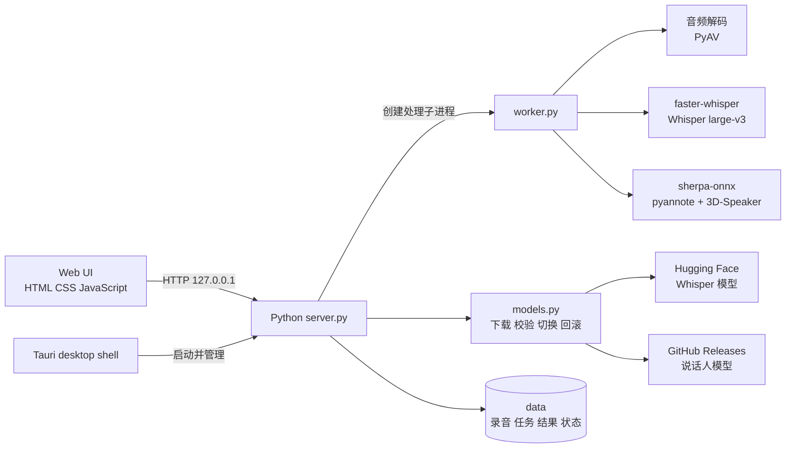

# HearNotes 系统架构说明

本文说明 HearNotes（听记）的主要组件、数据流和打包方式，便于后续维护、排错和扩展。

## 1. 系统定位

HearNotes 是 Windows 本地离线录音转写与说话人分离桌面应用。Tauri 负责桌面窗口和安装包，Python 引擎负责本机 HTTP 服务、模型管理和音频处理，前端页面负责交互和结果校对。

正常转写不会上传录音，也不会调用云端语音识别 API。首次下载模型、检查模型更新和检查软件更新需要网络连接。

## 2. 总体结构



## 3. 目录职责

| 路径 | 职责 |
| --- | --- |
| `HearNotes/ui/` | 页面、样式、多语言文本和浏览器端交互逻辑 |
| `HearNotes/server.py` | 本机 HTTP 服务、任务队列、上传、导出和更新 API |
| `HearNotes/worker.py` | 单条录音的解码、说话人分离、转写和结果保存 |
| `HearNotes/models.py` | 模型版本检查、下载、SHA-256 校验、安装、切换和回滚 |
| `HearNotes/bootstrap.py` | 运行目录、数据目录、Python 模块和 DLL 搜索路径初始化 |
| `HearNotes/core.py` | 转写结果处理、时间对齐、编辑应用和导出格式 |
| `HearNotes/runtime-cuda/` | sherpa-onnx CUDA 运行库和 ONNX Runtime |
| `src-tauri/src/main.rs` | Tauri 窗口、sidecar 启动和退出时进程树清理 |
| `src-tauri/tauri.conf.json` | Tauri 资源、图标、NSIS 和离线 WebView 配置 |
| `src-tauri/nsis/hooks.nsh` | 用户勾选删除应用数据时清理安装目录下的 `data` |
| `scripts/build-engine.ps1` | 使用 PyInstaller 编译 Python sidecar |
| `scripts/build-tauri.ps1` | 准备工具链并调用 Tauri 生成安装包 |

## 4. 转写数据流

1. 用户在前端选择或拖入音频文件。
2. `server.py` 创建任务目录，将原始音频和任务设置保存到 `data/jobs/<任务 ID>/`。
3. 服务端启动独立的 `worker.py` 子进程，因此关闭任务或软件时可以单独终止处理进程。
4. worker 使用 PyAV 解码音频；使用 sherpa-onnx 生成说话人时间段和声音特征；使用 faster-whisper 生成带时间戳的文本。
5. 核心逻辑把文本段与说话人时间段对齐，写入 `result.json`、`raw_segments.jsonl` 和 `voice_turns.json`。
6. 前端读取结果，支持逐段回听、编辑、统一修改发言人姓名及导出 TXT、Markdown、SRT、JSON。

## 5. 模型管理

模型不随安装包发布。模型页面从官方来源获取版本信息，下载到 `data/models/versions/`，文件先写入 `.part` 临时文件，完成长度和 SHA-256 校验后才改名。

安装验证通过后，程序只更新 `data/models.json` 中的 active 指针；旧版本保留在 previous 指针中，因此失败时不会覆盖当前模型，也可以执行回滚。若发现同一版本已经完整下载，安装流程会复用本地文件而不是重复下载。

当前模型及来源：

- Whisper large-v3 CTranslate2 转换版本：`Systran/faster-whisper-large-v3`。
- pyannote segmentation 3.0 ONNX：`k2-fsa/sherpa-onnx` speaker-segmentation release。
- 3D-Speaker ERes2Net 声音特征模型：`k2-fsa/sherpa-onnx` speaker-recongition release。

## 6. 打包与运行

开发版由 Python 服务直接运行；桌面版由 Tauri 启动 `hearnotes-engine.exe` sidecar。PyInstaller 引擎排除 `faster_whisper`、`ctranslate2`、`av` 和 `sherpa_onnx` 的内嵌副本，改为从安装目录的 `.audio-tools` 和 `runtime-cuda` 资源加载，避免 DLL 版本冲突。

安装包使用 NSIS 完整离线 WebView 模式。模型、录音和任务结果不放入安装包，因而安装包不会包含约 3 GB 的 Whisper 模型；模型由用户在软件中按需下载。

构建入口：

```powershell
npm run tauri:build
```

## 7. 进程和退出处理

Tauri 保存 sidecar 的进程句柄。窗口退出时，Windows 使用 `taskkill /PID /T /F` 终止 HearNotes 引擎及其 worker 子进程，避免转写进程在关闭窗口后残留。服务端在关闭时删除本机实例文件，避免下次启动误判为已有实例。

## 8. 已知限制

- 说话人 A、B、C 是声音聚类标签，不是身份认证结果。
- 重叠发言、噪声、回声和远距离录音可能导致说话人归属错误。
- GPU 模式依赖对应 NVIDIA 驱动和 CUDA/cuDNN 运行库；无法加载时可改用 CPU 或混合模式。
- 模型下载依赖 Hugging Face 和 GitHub，在网络受限环境中可能需要代理或手动准备模型文件。

