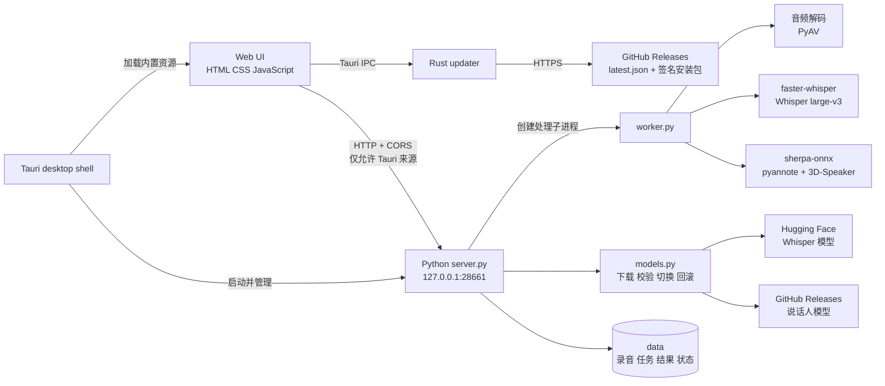
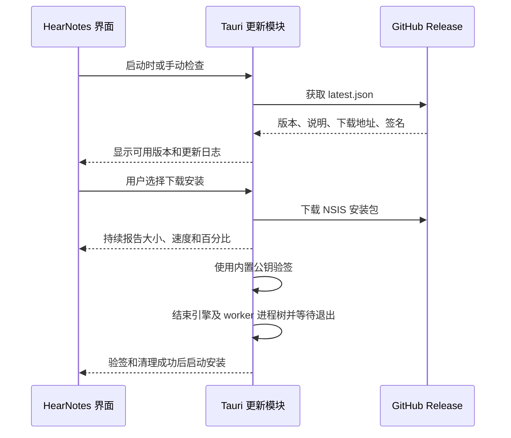

# HearNotes 系统架构说明

本文说明 HearNotes（听记）的主要组件、数据流和打包方式，便于后续维护、排错和扩展。

## 1. 系统定位

HearNotes 是 Windows 本地离线录音转写与说话人分离桌面应用。Tauri 负责桌面窗口和安装包，Python 引擎负责本机 HTTP 服务、模型管理和音频处理，前端页面负责交互和结果校对。

正常转写不会上传录音，也不会调用云端语音识别 API。首次下载模型、检查模型更新和检查软件更新需要网络连接。

## 2. 总体结构



## 3. 目录职责

| 路径 | 职责 |
| --- | --- |
| `HearNotes/ui/` | 页面、样式、多语言文本和浏览器端交互逻辑 |
| `HearNotes/server.py` | 本机 HTTP 服务、任务队列、上传、导出和更新 API |
| `HearNotes/worker.py` | 单条录音的解码、说话人分离、转写和结果保存 |
| `HearNotes/models.py` | 模型版本检查、下载、SHA-256 校验、安装、切换和回滚 |
| `HearNotes/bootstrap.py` | 运行目录、数据目录、Python 模块和 DLL 搜索路径初始化 |
| `HearNotes/core.py` | 转写结果处理、时间对齐、编辑应用和导出格式 |
| `HearNotes/runtime-cuda/` | sherpa-onnx CUDA 运行库和 ONNX Runtime |
| `src-tauri/src/main.rs` | Tauri 窗口、sidecar 启动和退出时进程树清理 |
| `src-tauri/tauri.conf.json` | Tauri 内置页面、资源、图标、NSIS 和签名更新配置 |
| `src-tauri/nsis/hooks.nsh` | 用户勾选删除应用数据时清理安装目录下的 `data` |
| `scripts/build-engine.ps1` | 使用 PyInstaller 编译 Python sidecar |
| `scripts/build-tauri.ps1` | 准备工具链并调用 Tauri 生成安装包 |

## 4. 转写数据流

1. 用户在前端选择或拖入音频文件。
2. `server.py` 创建任务目录，将原始音频和任务设置保存到 `data/jobs/<任务 ID>/`。
3. 服务端启动独立的 `worker.py` 子进程，因此关闭任务或软件时可以单独终止处理进程。
4. worker 使用 PyAV 解码音频；使用 sherpa-onnx 生成说话人时间段和声音特征；使用 faster-whisper 生成带时间戳的文本。
5. 核心逻辑把文本段与说话人时间段对齐，写入 `result.json`、`raw_segments.jsonl` 和 `voice_turns.json`。
6. 前端读取结果，支持逐段回听、编辑、统一修改发言人姓名及导出 TXT、Markdown、SRT、JSON。

默认说话人名称统一使用 `Speaker A`、`Speaker B` 等英文形式，不确定项使用 `Needs review`。旧记录中的“说话人 A”“話者 A”等系统默认值会在界面中兼容显示为英文；用户自行修改的姓名保持原样。

处理进度使用与语言无关的 `stage_key`（例如 `preparing`、`transcribing`、`diarizing`）在 Python 引擎和前端之间传递。前端再根据当前界面语言从 `ui/i18n.js` 取出对应文案，因此处理中切换中文、日文或英文时，进度标题和已知的回退提示会立即更新。旧任务中仅保存的中文阶段名称仍通过兼容映射显示。录音语言只用于语音识别，与界面显示语言相互独立。

## 5. 模型管理

模型不随安装包发布。模型页面从官方来源获取版本信息，下载到 `data/models/versions/`，文件先写入 `.part` 临时文件，完成长度和 SHA-256 校验后才改名。

安装验证通过后，程序只更新 `data/models.json` 中的 active 指针；旧版本保留在 previous 指针中，因此失败时不会覆盖当前模型，也可以执行回滚。若发现同一版本已经完整下载，安装流程会复用本地文件而不是重复下载。

当前模型及来源：

- Whisper large-v3 CTranslate2 转换版本：`Systran/faster-whisper-large-v3`。
- pyannote segmentation 3.0 ONNX：`k2-fsa/sherpa-onnx` speaker-segmentation release。
- 3D-Speaker ERes2Net 声音特征模型：`k2-fsa/sherpa-onnx` speaker-recongition release。

## 6. 打包与运行

开发版由 Python 服务直接提供页面；桌面版由 Tauri 从安装包内加载 `HearNotes/ui/`，同时启动 `hearnotes-engine.exe` sidecar。桌面界面不再依赖 `http://127.0.0.1:28661` 提供静态页面，该地址只承载转写、模型和录音数据接口，因此 Tauri 更新命令可以通过内置 IPC 正常调用。

Python 引擎只监听本机回环地址。桌面模式会校验 `Host`、Tauri 页面来源和修改请求中的 `X-Local-App` 标记，并只为 `http://tauri.localhost`、`https://tauri.localhost` 和 `tauri://localhost` 返回跨域许可。普通网站不能借用该端口读取录音或发起任务。源码模式仍使用启动时生成的随机 Cookie 保护本机服务。

PyInstaller 引擎排除 `faster_whisper`、`ctranslate2`、`av` 和 `sherpa_onnx` 的内嵌副本，改为从安装目录的 `.audio-tools` 和 `runtime-cuda` 资源加载，避免 DLL 版本冲突。

安装包使用 NSIS 完整离线 WebView 模式。模型、录音和任务结果不放入安装包，因而安装包不会包含约 3 GB 的 Whisper 模型；模型由用户在软件中按需下载。

## 7. 软件更新

软件启动后默认检查更新，也可以在“模型与更新”页面手动检查。前端通过 Tauri IPC 调用 Rust 更新模块；更新模块从公开 GitHub Release 读取 `latest.json`，比较版本后下载 NSIS 安装包，并使用配置中的公钥验证 `.sig` 签名。只有验签成功的安装包才会进入安装流程。

下载期间，Rust 持续记录已下载字节数、文件总大小、平均下载速度、百分比和当前阶段；前端每 250 毫秒读取一次该状态并在模态弹窗中显示。下载完成后依次显示签名验证、关闭后台引擎和启动安装程序，避免用户在大文件下载期间无法判断软件是否仍在工作。

签名私钥仅保存在开发机的 `.signing/` 或发布环境中，不写入仓库，也不随软件分发。用户电脑只保存公钥，不需要 GitHub PAT。软件更新、模型下载和转写数据三条路径彼此独立。

更新功能验证使用唯一递增的语义化版本号。客户端只接受高于当前版本的发布，因此测试下载弹窗、验签和安装流程时，需要先安装包含待测逻辑的版本，再发布一个更高版本作为更新目标。

更新顺序如下：



构建入口：

```powershell
npm run tauri:build
```

## 8. 进程和退出处理

Tauri 保存 sidecar 的进程句柄。窗口正常退出时，Windows 使用 `taskkill /PID /T /F` 终止 HearNotes 引擎及其 worker 子进程，避免转写进程在关闭窗口后残留。软件更新会直接结束 Tauri 主进程，因此更新命令在调用安装器前也执行同一进程树清理，并通过 Windows 进程句柄最多等待 5 秒确认引擎已经退出，再留出短暂时间释放可执行文件句柄。NSIS 的 `NSIS_HOOK_PREINSTALL` 还会在更新模式下按进程名执行一次兼容清理，使尚未包含新退出逻辑的旧版客户端也能升级。服务端在关闭时删除本机实例文件，避免下次启动误判为已有实例。

## 9. 已知限制

- 说话人 A、B、C 是声音聚类标签，不是身份认证结果。
- 重叠发言、噪声、回声和远距离录音可能导致说话人归属错误。
- GPU 模式依赖对应 NVIDIA 驱动和 CUDA/cuDNN 运行库；无法加载时可改用 CPU 或混合模式。
- 模型下载依赖 Hugging Face 和 GitHub，在网络受限环境中可能需要代理或手动准备模型文件。
- 桌面版引擎当前固定使用本机端口 `28661`；如果该端口被其他程序占用，启动会失败，需要先释放端口。
